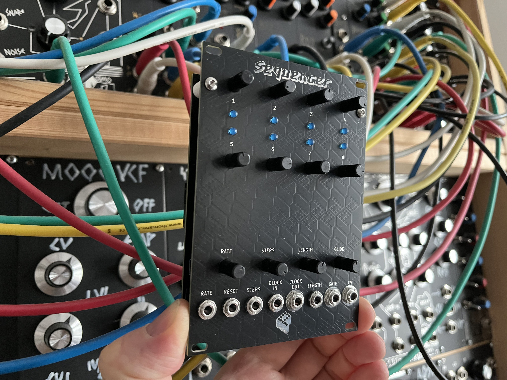

# Eurorack Sequencer Software

This repository holds the software for my [Arduino based Eurorack Sequencer](https://polykit.rocks/sequencer). The sequencer has 8 steps, various CV options, it is easily extendible and multiple units can be chained together for longer sequences.



## Specs

- 8-step sequencer
- un-quantized CV output
- Arduino based open-source software
- controls for rate, step count, gate length, and glide
- CV for rate, step count, and gate length
- clock in/out
- gate output
- reset input
- extension port
- multiple units can be chained
- voltage range 0-5V
- 18HP

## Install

To upload or modify the firmware, you’ll need the Arduino IDE (or any compatible toolchain) to compile and flash the code to the microcontroller. There is a Makefile that uses `arduino-cli` to compile and flash your microcontroller.

```
$ make help
Available targets:
  make compile      - Compile the sketch
  make upload       - Compile and upload to Arduino (uses PORT=/dev/ttyUSB0)
  make build-upload - Same as upload
  make monitor      - Open serial monitor (uses PORT=/dev/ttyUSB0, BAUD_RATE=115200)
  make ports        - List available serial ports
  make clean        - Remove build artifacts
  make check        - Verify arduino-cli is installed

Override PORT: make upload PORT=/dev/ttyACM0
Override ARDUINO_CLI: make compile ARDUINO_CLI=arduino-cli
```
